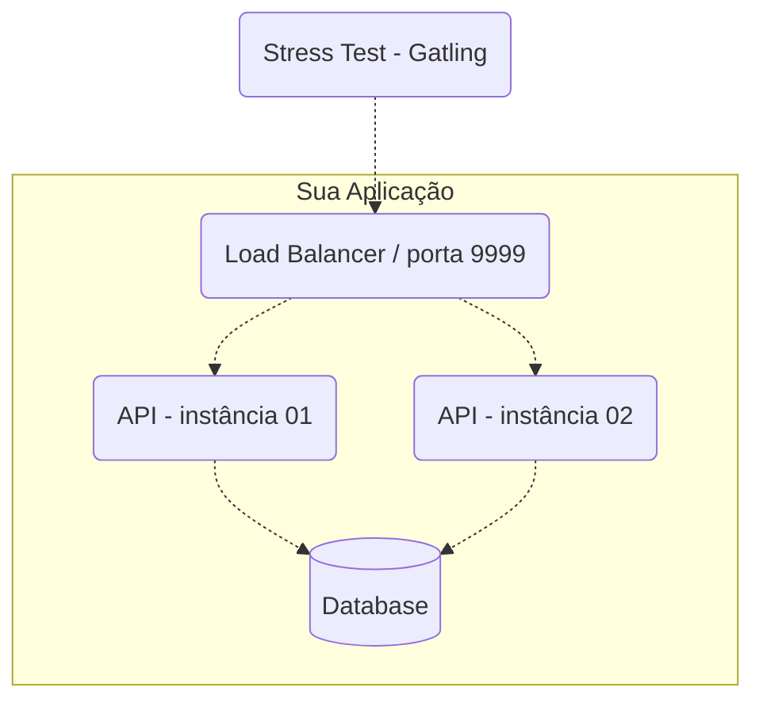

# Teste Backend

## O Que Precisa Ser Feito?

Você precisa desenvolver uma API HTTP com os seguintes endpoints:

### Transações

**Requisição**

`POST /clientes/[id]/transacoes`

```json
{
  "valor": 1000,
  "tipo": "c",
  "descricao": "descricao"
}
```

Onde

- `[id]` (na URL) deve ser um número inteiro representando a identificação do cliente.
- `valor` deve ser um número inteiro positivo que representa centavos (não vamos trabalhar com frações de centavos). Por exemplo, R$ 10 são 1000 centavos.
- `tipo` deve ser apenas `c` para crédito ou `d` para débito.
- `descricao` deve ser uma string de 1 a 10 caracteres.

Todos os campos são obrigatórios.

**Resposta**

`HTTP 200 OK`

```json
{
  "limite": 100000,
  "saldo": -9098
}
```

Onde

- `limite` deve ser o limite cadastrado do cliente.
- `saldo` deve ser o novo saldo após a conclusão da transação.

_Obrigatoriamente, o http status code de requisições para transações bem sucedidas deve ser 200!_

**Regras**
Uma transação de débito **nunca** pode deixar o saldo do cliente menor que seu limite disponível. Por exemplo, um cliente com limite de 1000 (R\$ 10) nunca deverá ter o saldo menor que -1000 (R\$ -10). Nesse caso, um saldo de -1001 ou menor significa inconsistência!

Se uma requisição para débito for deixar o saldo inconsistente, a API deve retornar HTTP Status Code 422 sem completar a transação! O corpo da resposta nesse caso não será testado e você pode escolher como o representar. HTTP 422 também deve ser retornado caso os campos do payload estejam fora das especificações como, por exemplo, uma string maior do que 10 caracteres para o campo `descricao` ou algo diferente de `c` ou `d` para o campo `tipo`. Se para o campo `valor` um número não inteiro for especificado, você poderá retornar HTTP 422 ou 400.

Se o atributo `[id]` da URL for de uma identificação não existente de cliente, a API deve retornar HTTP Status Code 404. O corpo da resposta nesse caso não será testado e você pode escolher como o representar.

## Extrato

**Requisição**

`GET /clientes/[id]/extrato`

Onde

- `[id]` (na URL) deve ser um número inteiro representando a identificação do cliente.

**Resposta**

`HTTP 200 OK`

```json
{
  "saldo": {
    "total": -9098,
    "data_extrato": "2024-01-17T02:34:41.217753Z",
    "limite": 100000
  },
  "ultimas_transacoes": [
    {
      "valor": 10,
      "tipo": "c",
      "descricao": "descricao",
      "realizada_em": "2024-01-17T02:34:38.543030Z"
    },
    {
      "valor": 90000,
      "tipo": "d",
      "descricao": "descricao",
      "realizada_em": "2024-01-17T02:34:38.543030Z"
    }
  ]
}
```

Onde

- `saldo`
  - `total` deve ser o saldo total atual do cliente (não apenas das últimas transações seguintes exibidas).
  - `data_extrato` deve ser a data/hora da consulta do extrato.
  - `limite` deve ser o limite cadastrado do cliente.
- `ultimas_transacoes` é uma lista ordenada por data/hora das transações de forma decrescente contendo até as 10 últimas transações com o seguinte:
  - `valor` deve ser o valor da transação.
  - `tipo` deve ser `c` para crédito e `d` para débito.
  - `descricao` deve ser a descrição informada durante a transação.
  - `realizada_em` deve ser a data/hora da realização da transação.

**Regras**
Se o atributo `[id]` da URL for de uma identificação não existente de cliente, a API deve retornar HTTP Status Code 404. O corpo da resposta nesse caso não será testado e você pode escolher como o representar.

## Cadastro Inicial de Clientes

Para haver ênfase em concorrência durante o teste, poucos clientes devem ser cadastrados e testados. Por isso, apenas cinco clientes, com os seguintes IDs, limites e saldos iniciais, devem ser previamente cadastrados para o teste – isso é imprescindível!

| id  | limite   | saldo inicial |
| --- | -------- | ------------- |
| 1   | 100000   | 0             |
| 2   | 80000    | 0             |
| 3   | 1000000  | 0             |
| 4   | 10000000 | 0             |
| 5   | 500000   | 0             |

Obs.: Não cadastre um cliente com o ID 6 especificamente, pois parte do teste é verificar se o cliente com o ID 6 realmente não existe e a API retorna HTTP 404!

## Como Fazer e Entregar?

Você precisará conteinerizar sua API e outros componentes usados no formato de _docker-compose_, obedecer às [restrições de recursos de CPU e memória](#restricoes), [configuração mínima arquitetural](#arquitetura), e estrutura de artefatos e processo de entrega (o que, onde e quando suas coisas precisam ser entregues).

### Artefato, Processo e Data Limite de Entrega

Para participar, basta fazer um pull request a partir de um fork deste repositório incluindo um subdiretório em [participantes](./participantes) com os seguintes arquivos:

- `docker-compose.yml` - arquivo interpretável por `docker-compose` contendo a declaração dos serviços que compõe sua API respeitando as [restrições de CPU/memória](#restricoes) e [arquitetura mínima](#arquitetura).
- `README.md` - incluindo pelo menos seu nome, tecnologias que usou e o link para o repositório do código fonte da sua API.
- Inclua aqui também quaisquer outros diretórios/arquivos necessários para que seus contêineres subam corretamente como, por exemplo, `nginx.conf`, `banco.sql`, etc.

[Aqui](./participantes/exemplo) tem um exemplo de submissão para te ajudar, caso queira.

**Importante!** É fundamental que todos os serviços declarados no `docker-compose.yml` estejam publicamente disponíveis! Caso contrário, não será possível executar os testes. Para isso, você pode criar uma conta em hub.docker.com para disponibilizar suas imagens. Essa imagens geralmente terão o formato \<user\>/\<imagem\>:\<tag\> – por exemplo, `sizebay/test-backend:latest`.

**Importante!** É obrigatório deixar o repositório contendo o código fonte da sua API publicamente acessível e informado no arquivo `README.md` entregue na submissão.

Um exemplo de submissão/pull request do Fulano, poderia ter os seguintes arquivos:

```
├─ participantes/
|  ├─ fulano/
|  |  ├─ docker-compose.yml
|  |  ├─ nginx.config
|  |  ├─ init.sql
|  |  ├─ README.md
```

### <a name="arquitetura">Arquitetura Mínima da API</a>

Por "API" aqui, me refiro a todos os serviços envolvidos para que o serviço que atenderá às requisições HTTP funcione, tais como o load balancer, banco de dados e servidor HTTP.

A sua API precisa ter, no mínimo, os seguintes serviços:

- Um **load balancer** que faça a distribuição de tráfego usando o algoritmo round robin. Diferentemente da edição anterior, você não precisa usar o Nginx – pode escolher (ou até fazer) qualquer um como p.ex. o HAProxy. **O load balancer será o serviço que receberá as requisições do teste e ele precisa aceitar requisições na porta 9999**!
- **2 instâncias de servidores web** que atenderão às requisições HTTP (distribuídas pelo load balancer).
- Um banco de dados relacional ou não relacional (exceto bancos de dados que têm como principal característica o armazenamento de dados em memória, tal como Redis, por exemplo).



**Nota**: Você pode usar componentes adicionais se quiser. Mas lembre-se de que as restrições de CPU e memória devem obedecer a regra de que a soma dos limites (que devem ser declarados para todos os serviços) não poderá ultrapassar 1.5 unidades de CPU e 550MB de memória!

### <a name="restricoes">Restrições de CPU/Memória</a>

Dentro do seu arquivo docker-compose.yml, você deverá limitar todos os serviços para que a soma deles não ultrapasse os seguintes limites:

- `deploy.resources.limits.cpu` 1.5 – uma unidade e meia de CPU distribuída entre todos os seus serviços
- `deploy.resources.limits.memory` 550MB – 550 mega bytes de memória distribuídos entre todos os seus serviços

Obs.: Por favor, use `MB` para unidade de medida de memória; isso facilita as verificações de restrições.

```yml
# exemplo de parte de configuração de um serviço dentro do um arquivo docker-compose.yml
---
nginx:
  image: nginx:latest
  volumes:
    - ./nginx.conf:/etc/nginx/nginx.conf:ro
  depends_on:
    - api01
    - api02
  ports:
    - "9999:9999"
  deploy:
    resources:
      limits:
        cpus: "0.17"
        memory: "10MB"
```

## Ferramenta de Teste

A ferramenta Gatling será usada para realizar o teste de performance. Pode fazer muita diferença você executar os testes durante a fase de desenvolvimento para detectar possíveis problemas e gargalos. O teste está disponível nesse repositório em [load-test](./load-test).

## Ambiente de Testes

Note que o ambiente em que os testes serão executados é Linux x64. Portanto, se seu ambiente de desenvolvimento possui outra arquitetura, você precisará fazer o build do docker da seguinte forma:
`$ docker buildx build --platform linux/amd64`

### Para executar os testes

Aqui estão instruções rápidas para você poder executar os testes:

1. Baixe o Gatling em https://gatling.io/open-source/
1. Certifique-se de que tenha o JDK instalado
   (64bits OpenJDK LTS (Long Term Support) versions: 11, 17 e 21)
   https://gatling.io/docs/gatling/tutorials/installation/
1. Certifique-se de configurar a variável de ambiente GATLING_HOME para o diretório da instalação do Gatling.
   Para se certificar de que a variável está correta, os seguinte caminhos precisam ser válidos:
   `$GATLING_HOME/bin/gatling.sh` no Linux e `%GATLING_HOME%\bin\gatling.bat` no Windows.
1. Configure o script `./executar-teste-local.sh` (ou `./executar-teste-local.ps1` se estiver no Windows)
1. Suba sua API (ou load balancer) na porta 9999
1. Execute `./executar-teste-local.sh` (ou `./executar-teste-local.ps1` se estiver no Windows)
1. Agora é só aguardar o teste terminar e abrir o relatório
   O caminho do relatório é exibido ao término da simulação.
   Os resultados/relatórios são salvos em `./load-test/user-files/results`.
